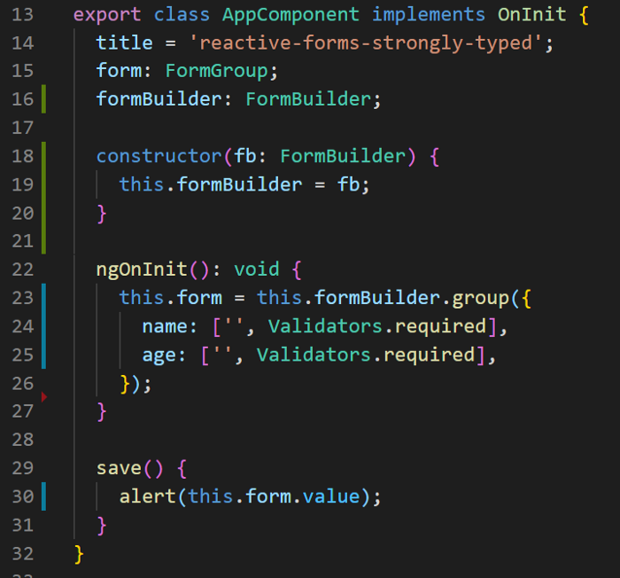
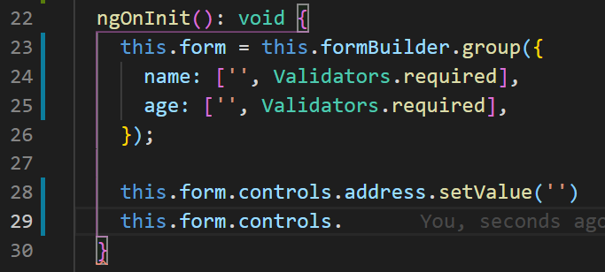
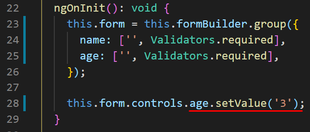
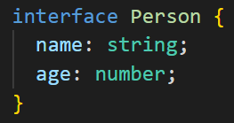
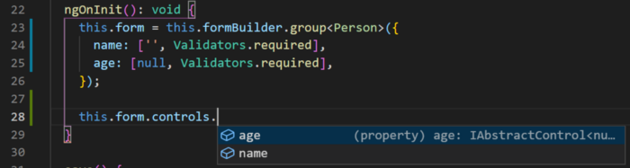
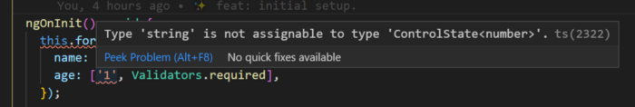
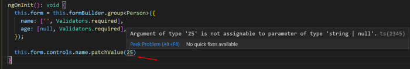
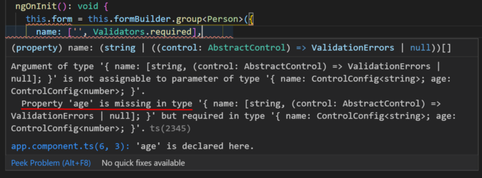

## 📖 Sobre o projeto

Está aplicação serve apenas de exemplo de como implementar Tipagem Forte no React Forms do Angular.

## 🤖 Tecnologias e Recursos

- [Angular 11](https://angular.io/)
  - [Angular Material 11.0.4](https://material.angular.io/)
  - [@RxWeb](https://www.npmjs.com/package/@rxweb/types?activeTab=readme)

Muitos de nós amamos utilizar o TypeScript por causa de sua forte tipagem de dados, como alguns já devem saber, os Reactive Forms do Angular não são fortemente tipados / strongly typed a classe AbstractControl e suas implementações FormControl, FormGroup e FormArray não suportam tipagem forte em seus valores ou alterações ou em qualquer propriedade/método. Isso foi uma coisa que sempre me incomodou pelos motivos que irei citar abaixo:

Considerando que tenhamos o seguinte form criado abaixo com as propriedades name e age:



- Não possuir intellisense para as propriedades existentes no form.

  

  Aqui você percebe que ao acessar a propriedade controls do seu form (linha 29), você não possui o autocomplete das propriedades existentes e mesmo tentando acessar um propriedade que não existe (linha 28) você não terá nenhuma checagem por parte do typescript, ocorrendo o erro apenas em tempo de execução (que é uma maravilha quando encadeado com outros erros 😬).

- Sem checagem de compatibilidade de tipos na atribuição de valores.

  

  Suponhamos que no caso da propriedade age quiséssemos restringir a atribuição a apenas valores do tipo number (linha 28), com o form padrão isso não é possível pois o método setValue da classe AbstractControl recebe como parâmetro uma propriedade value que é do typo any, portanto o typescript não sabe como realizar a checagem.

- Não é possível definir uma estrutura para o form baseado em uma interface.

  

  Caso quiséssemos ter uma interface que defina a estrutura do nosso form como essa acima.

  e que o nosso form seja validado de acordo com o tipo e as propriedades existentes nessa interface, dessa forma com qualquer alteração na interface o nosso form acusaria imediatamente a falta da mesma, com os forms nativos do Angular isso não é possível.

  Diante dessa situação que sempre me incomodou eu comecei a procurar se já não havia alguma solução para isso por parte do time do angular ou até mesmo pelos próprios usuários.

  Dentre as minhas pesquisas encontrei algumas bibliotecas que te entregam esse comportamento de forms tipados, porém algumas delas o próprio idealizador da biblioteca não manteve as atualizações e o projeto foi abandonado, diante dessa situação dependendo do projeto que estiver é meio arriscado se acoplar dessa forma a uma biblioteca externa.

  Todos os pontos acima podem ser resolvidos, criando classes genéricas que estendem as classes básicas (FormGroup, FormControl e FormArray) que é o que algumas das bibliotecas que citei fazem. Mas ainda assim teríamos alguns problemas:

  - Perder o principal beneficio da classe FormBuilder para criação de FormControl, FormGroup e FormArray de forma fácil.
  - Qualquer erro ocorrido na classe genérica irá provocar comportamentos inesperados na aplicação
  - Dificuldade de gerenciar FormGroup e FormArray aninhados que possuem tipagem
  - Grandes chances de misturar 2 abordagens na aplicação tendo alguns objetos do FormGroup sendo criados por uma classe genérica e outros sendo criados através da classe do @angular/forms

  Portanto a forma mais simples e menos acoplada que encontrei para resolver esse pontos e sem aumentar sequer 1 byte no tamanho do bundle final da aplicação, foi a de utilizar os arquivos de declaração de tipo do próprio TS (\*.d.ts) adicionando interfaces genéricas que estendem de FormControl e AbstractControl.

  ## Solução

  Com uma pequena ajuda do Interface Segregation Principle nós podemos atingir de ponta a ponta a tipagem forte nos Reactive Forms sem a necessidade de uma classe genérica.

  Iremos utilizar o [@rxweb/types](https://www.npmjs.com/package/@rxweb/types?activeTab=readme) para converter nosso Reactive Form em um Form fortemente tipado.

  Este pacote contém apenas definições de tipo, portanto, não há risco de quebras de código durante o tempo de execução.

  Para instalar as tipagem utilize o comando abaixo:

  ```
  npm install @rxweb/types
  ```

  Dessa forma agora poderemos utilizar 2 interfaces bastante interessantes que é a IFormGroup<T> e IFormBuilder onde no generics do IFormGroup poderemos passar uma interface ou type nosso, assim o type script saberá identificar as propriedades e também realizar a checagem dos tipos.

  Então a definição do nosso form ficaria assim utilizando aquela mesma interface Person mostrada anteriormente:
  Image for post
  Dessa forma nós teremos todos aqueles pontos corrigidos e checados pelo typescript:

  - Intellisense para todas as propriedades existentes no form.

    

    como o form agora utiliza a interface IFormGroup<Person> sempre que acessarmos a propriedade controls do nosso form, nós teremos o intellisense.

  - Checagem de compatibilidade de tipos na atribuição de valores na criação e atualização do form.

    

    

    mesmo durante a criação dos controles do formulário ou mesmo na atualização de seus valores o typescript irá acusar erro caso o tipo atribuído seja incompatível.

  - Checagem das propriedades durante a criação do form.

    

    caso o formulário que esteja sendo criado não tenha as mesmas propriedades definidas na interface o typescript irá acusar a propriedade que está faltando.

    ## Conclusão

    A melhor parte dessa abordagem é que o nosso form agora é fortemente tipado através de uma interface sem ter que alterar a estrutura da classe base do Angular.
